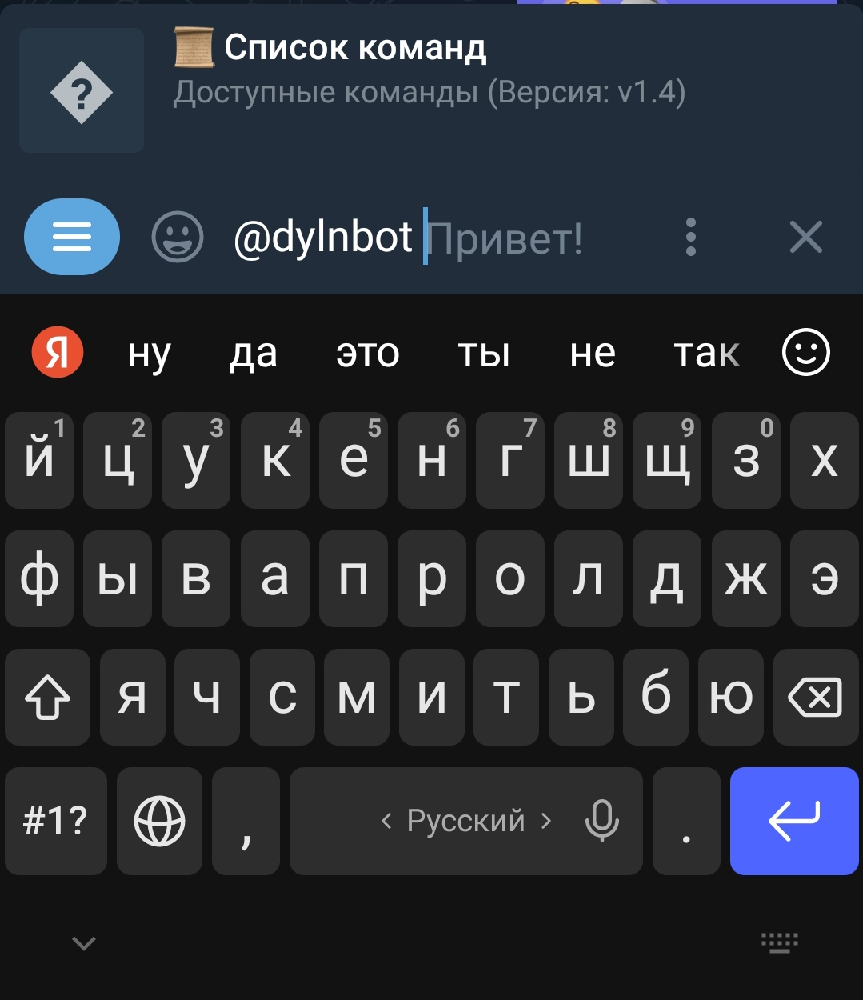
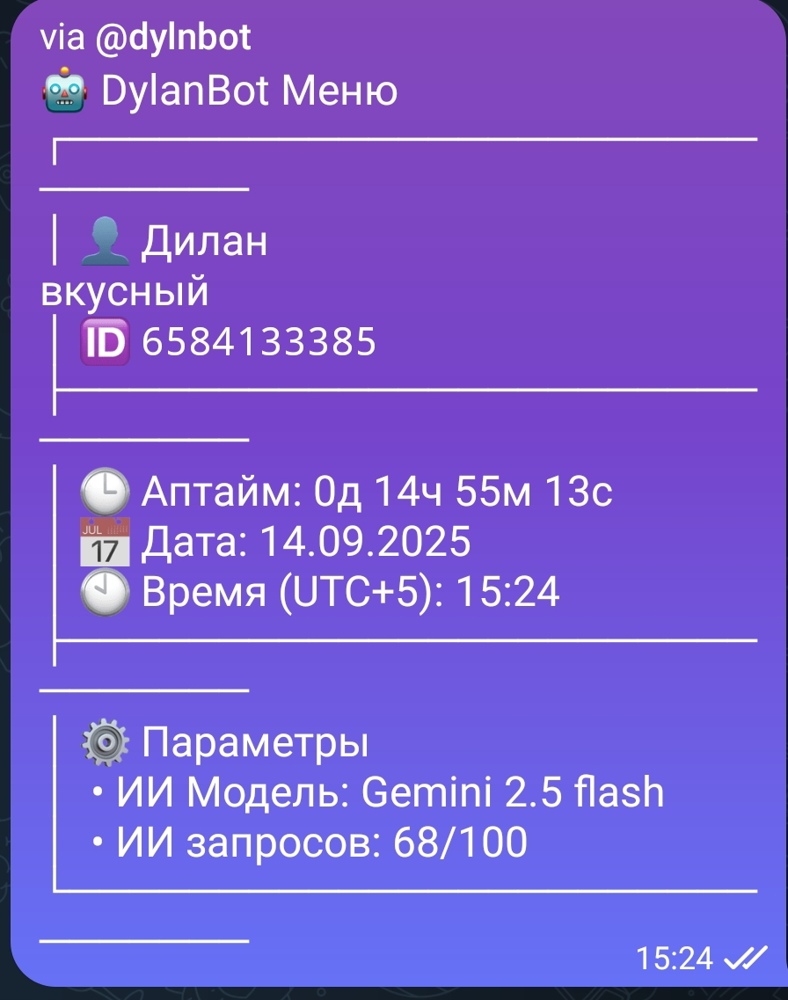

# DylanBot
Многофункциональный модульный инлайн бот прямо в Телеграме.
а еще бесплатный ии благодаря [pollination](https://github.com/pollinations/pollinations)
[Вот ботик](t.me/dylnbot)

Вот как нужно вызвать бота:

После написание @dylnbot вы можете написать команду, к примеру @dylnbot меню

Вывод команды меню

также очень рекомендую настроить время
@dylnbot время 15:20
если вы хотите сделать свою команду то смело заходите [документацию](https://github.com/DragonInc4/DylanBot/blob/main/docs.md)
Она очень простая и уже там все функции готовы
